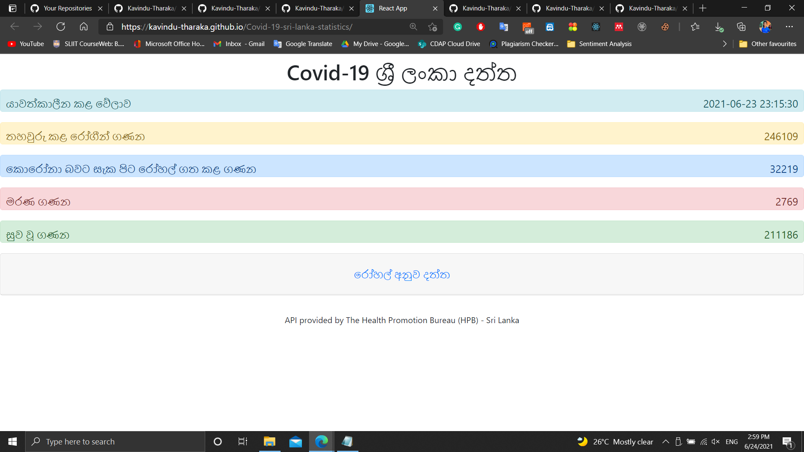
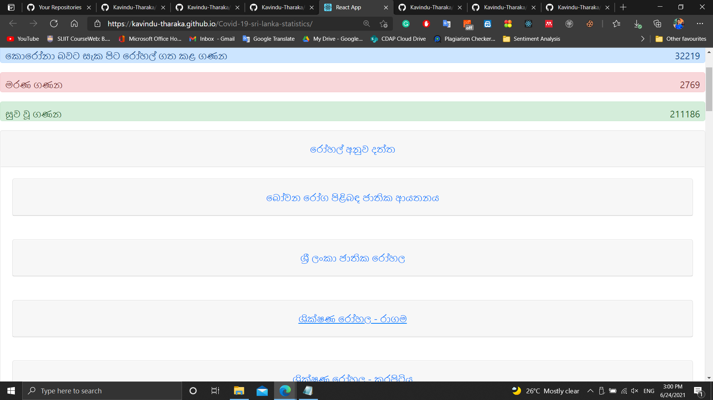
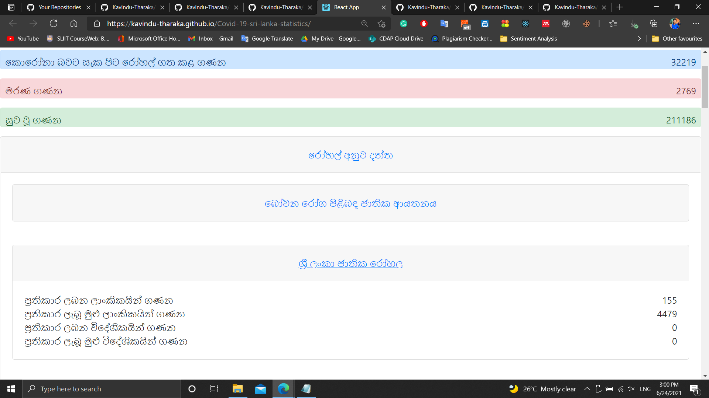

<h3 align="center">Covid-19 Sri Lanka Statistics</h3>

This Simple React web app was created when I was learning the fundamentals of the React js. We can view Hospital wise covid-19 stats in Sri Lanka using the API provided by The Health Promotion Bureau (HPB) - Sri Lanka.

  
  
  

